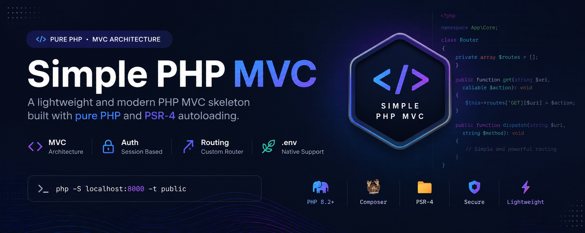

<p align="center">
    
</p>

<h1 align="center">
Simple PHP MVC Application
</h1>

<p align="center">
A lightweight PHP MVC skeleton built with pure PHP and PSR-4 autoloading.
Designed as a learning project and a foundation for future production-ready applications.
</p>

<p align="center">


</p>

---

# About

This project demonstrates how an MVC architecture works internally using pure PHP without depending on large frameworks.

The goal is to understand concepts such as:

- Routing
- Controllers
- Views
- Authentication
- Session management
- Environment variables
- Application organization
- MVC design patterns

while keeping the project lightweight and easy to extend.

---

# Why this project?

Most modern frameworks hide a large amount of internal behavior.

This project was created to understand the fundamentals first and gradually evolve into a larger architecture.

Instead of starting with a complete framework, the idea is to understand how things work behind the scenes.

---

# Features

✔ Simple MVC architecture  
✔ Controllers and Views separation  
✔ Custom routing system  
✔ Session authentication  
✔ Authorization levels  
✔ Front Controller pattern  
✔ Native `.env` implementation  
✔ Environment example file  
✔ PSR-4 autoloading  
✔ Lightweight structure  
✔ Beginner friendly

---

# Project Structure

```text
/
├── app/
│
│   ├── Controllers/
│   │
│   ├── Core/
│   │   ├── Router.php
│   │   ├── Controller.php
│   │   ├── Auth.php
│   │   └── Env.php
│   │
│   └── Views/
│
├── public/
│   └── index.php
│
├── routes/
│   └── web.php
│
├── .env.example
├── composer.json
├── vendor/
│
└── README.md
```

---

# Routes

Current route definitions:

```text
GET     /mvc/             -> HomeController@index

GET     /mvc/login        -> AuthController@login
POST    /mvc/login        -> AuthController@authenticate

GET     /mvc/logout       -> AuthController@logout

GET     /mvc/usuarios     -> UserController@index
```

---

# Authentication

The project currently uses a simple session-based authentication flow.

Login page:

```text
/mvc/login
```

Authentication:

```php
AuthController::authenticate()
```

Stores:

```php
$_SESSION['usuario']
```

Protected routes:

```php
Auth::requireLevel()
```

Demo credentials:

```text
Email:
admin@email.com

Password:
123456
```

---

# Environment Configuration

This project includes a native environment loader without external libraries.

Create your local file:

```bash
cp .env.example .env
```

Example:

```env
APP_NAME='MINI MVC'

APP_ENV=development
APP_KEY=base
APP_DEBUG=true
APP_URL=http://localhost/mvc

DB_CONNECTION=mysql
DB_HOST=127.0.0.1
DB_PORT=3306
DB_DATABASE=
DB_USERNAME=
DB_PASSWORD=
```

Usage:

```php
Env::get('DB_HOST');
```

or:

```php
getenv('DB_HOST');
```

---

# Installation

Install dependencies:

```bash
composer install
```

Run development server:

```bash
php -S localhost:8000 -t public
```

Open:

```text
http://localhost:8000/mvc/
```

If using a subdirectory:

```text
http://localhost/project-folder/
```

Make sure Router base path matches your project folder.

---

# Extending with Database

Example PDO connection:

```php
$pdo = new PDO(
    'mysql:host=localhost;dbname=your_db;charset=utf8',
    'user',
    'password'
);

$pdo->setAttribute(
    PDO::ATTR_ERRMODE,
    PDO::ERRMODE_EXCEPTION
);
```

Suggested future structure:

```text
app/

├── Models/
├── Services/
├── Repositories/
├── Middleware/
```

---

# Roadmap

Current development progress:

- [x] MVC structure
- [x] Controllers
- [x] Views
- [x] Routing
- [x] Authentication
- [x] Authorization
- [x] Native environment system
- [x] .env.example
- [ ] Models
- [ ] Database layer
- [ ] Repository pattern
- [ ] Middleware
- [ ] Validation system
- [ ] Flash messages
- [ ] CSRF protection
- [ ] Dependency Injection
- [ ] Migration system
- [ ] API support
- [ ] Role permissions

---

# Commit Convention

This project follows a simple commit pattern:

```text
feat: add new feature

fix: resolve bug

refactor: improve code structure

docs: update documentation

chore: maintenance tasks

style: formatting changes

test: add or update tests
```

Example:

```bash
feat: implement native environment configuration
```

---

# Future Goals

This small MVC skeleton may evolve into:

- Full authentication system
- Database abstraction
- ORM support
- API architecture
- Package system
- Dependency container
- Middleware pipeline
- Production-ready structure

---

# Contributing

Contributions, ideas and improvements are always welcome.

If you want to improve the project:

```bash
Fork
→ Clone
→ Create a branch
→ Commit changes
→ Open Pull Request
```

---

# Author

Developed by **Thiago Leite**

Full Stack Developer focused on:

- PHP
- Laravel
- React
- Next.js
- Node.js
- Infrastructure
- SaaS Platforms
- DevOps

---

# Support The Project ⭐

If you're learning from this project, using it in your own applications, or following its evolution:

Give the repository a star.

This helps the project grow and motivates future improvements.

⭐ Star the repository and follow the journey.

---

<p align="center">
Made with PHP and lots of coffee ☕
</p>

<p align="center">
Developed by Thiago Leite.
</p>